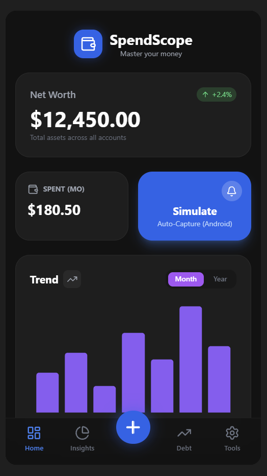
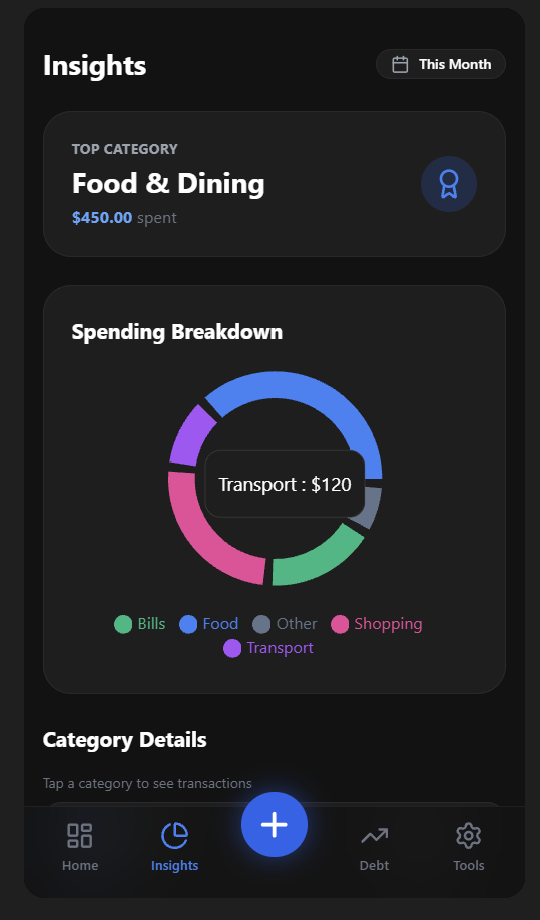
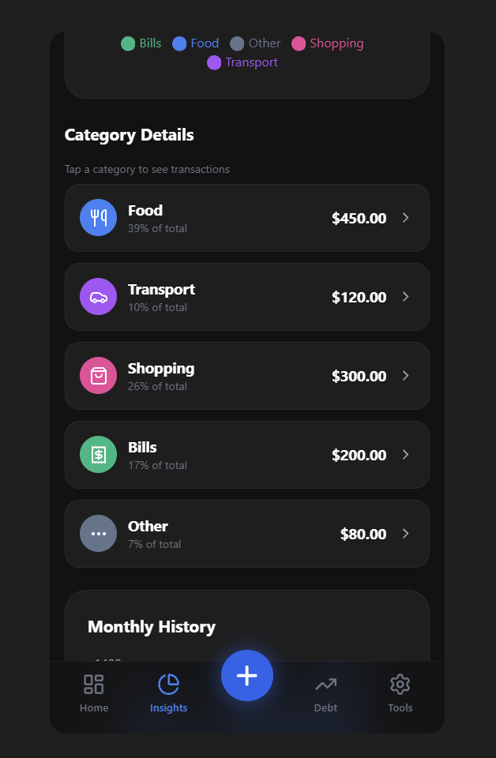
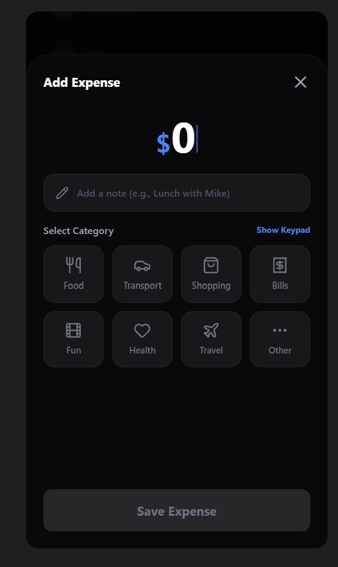

# MoneyMap 💳

MoneyMap (formerly SpendScope) is a premium personal finance tracking application built for mobile (iOS/Android) and web. It features a modern, high-performance UI with advanced charting to help you visualize your spending habits and master your money.

## ✨ Features

-   **Dynamic Dashboard**: Overview of net worth, spent amounts, and recent activity.
-   **Advanced Charting**: Interactive Bar and Line charts with fixed-position data display (optimized for touch).
-   **Insights**: Deep dive into spending categories with detailed breakdowns and trend analysis.
-   **Auto-Capture Simulator**: Experience automated transaction capturing.
-   **Dark Mode & Premium UI**: Glassmorphism, smooth animations, and a rich dark theme.

## 🚀 Getting Started

### Prerequisites

-   [Node.js](https://nodejs.org/) (v18+)
-   [npm](https://www.npmjs.com/) or [yarn](https://yarnpkg.com/)
-   [Expo Go](https://expo.dev/go) (for mobile preview) or an Emulator

### Project Structure

-   `/mobile`: Expo-based React Native mobile application.
-   `/backend`: Node.js/Express server with Prisma ORM and PostgreSQL.
-   `/app`: Web version of the dashboard.

---

### 1. Setup Backend

```bash
cd backend
npm install
# Configure your .env (DATABASE_URL, JWT_SECRET, etc.)
npx prisma migrate dev
npm run dev
```

### 2. Setup Mobile App

```bash
cd mobile
npm install
# Start Expo development server
npx expo start --clear
```

### 3. Setup Web Dashboard

```bash
npm install
npm run dev
```

## 🛠️ Tech Stack

-   **Mobile**: React Native, Expo, Gifted Charts, Lucide Icons.
-   **Backend**: Node.js, Express, Prisma, PostgreSQL, JWT Authentication.
-   **Web**: React, Vite, Recharts, Tailwind CSS.

## 📱 Screenshots

### Dashboard & Insights
<div align="center">
  
  
  
</div>

### Debt Management & Transactions
<div align="center">
  
  
  
</div>

